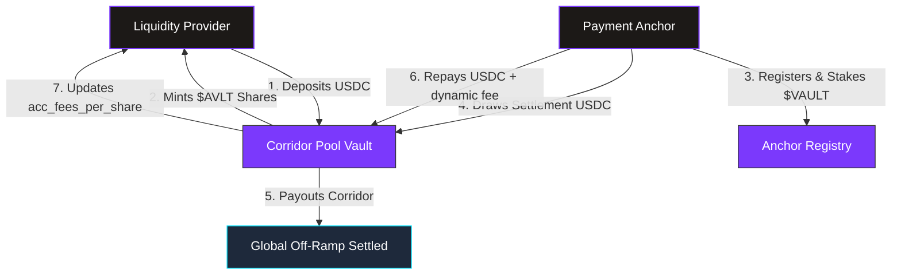
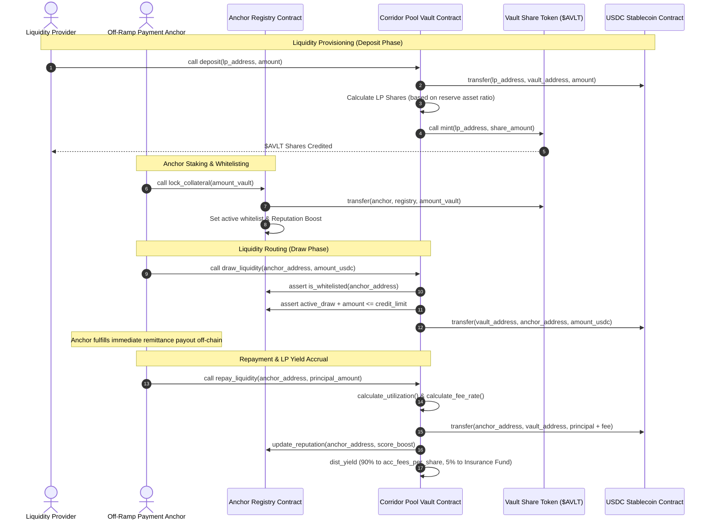

# 🛡️ AnchorVault: Trustless On-Chain Remittance Liquidity Routing

AnchorVault is a production-grade, decentralized liquidity protocol built on the **Stellar Soroban Smart Contract Platform**. It bridges Liquidity Providers (LPs) with authorized off-ramp payment anchors to facilitate instant, cross-border remittances. LPs lock stablecoin reserves into corridor pools and organic yield is dynamically routed to them from real payment settlement flows.

---

## 📍 Deployed Smart Contract Addresses (Stellar Testnet)

The AnchorVault protocol is fully deployed and configured on the **Stellar Testnet** at the following contract coordinates:

| Contract Component | Stellar Contract Address (C...) | Role / Responsibility |
| :--- | :--- | :--- |
| 💵 **Stellar USDC Stablecoin** | `CCW67CUUZD4BYLOXPUM6UJCY34UCCIC2CC3V2F` | Core asset of the corridor pools (Stellar Asset Contract) |
| 🪙 **Vault Share Token ($AVLT)** | `CCG35K57NAFGZ3EBIHEWLQEAOCNEF72DX3DQNJDJINT66GE5VW7TDTPC` | LP share representation minted dynamically during deposits |
| 🛡️ **Anchor Registry** | `CAWO6A52CISR4JITVFVN4NDDCSJA3MI5N6XCBN5XW2AE4JU3I4NHAUGJ` | Handles anchor whitelisting, reputation score calculation, and collateral stakes |
| 🏦 **Corridor Pool Core Vault** | `CCU3RFCKEG2OIQZMGY6C2UUQFCCN6TJDVMPNRR3D6FKRZAJGQ3EIPKJK` | Manages deposit/withdrawal arithmetic and anchor liquidity routing |

---

## 🗺️ Protocol Architecture & Flow Charts

AnchorVault coordinates three distinct entities trustlessly on-chain: **Liquidity Providers**, **Payment Anchors**, and the **Core Smart Contracts**.

### 1. High-Level Protocol Architecture


### 2. Detailed LP & Anchor Operational Lifecycle


---

## 📈 Core Working Functionality

### 1. Corridor Pool Vault (`anchor_vault`)
LPs deposit USDC stablecoin to earn interest from global cross-border remittances. When USDC is deposited, LPs are minted **$AVLT** share tokens.
* **LP Deposits & Withdrawals**: LP deposit shares are calculated relative to the entire pool valuation (Cash Reserves + Outstanding Anchor Draws). If the pool is highly utilized, withdrawals are queued or restricted to protect liquidity.
* **Yield Accrual Mechanism**: As anchors repay their draws plus interest, **90% of the settlement fee** is added to `acc_fees_per_share` (scaled by $10^{12}$ for precise fraction arithmetic). The next time an LP interacts with the pool (e.g. deposits or withdraws), their accumulated share of yield is automatically disbursed.

### 2. Anchor Registry (`anchor_registry`)
Before drawing capital to settle a payment, anchors must undergo reputational whitelisting.
* **Collateral Lockups**: Anchors lock up governance $VAULT tokens into the registry to back their credit capacity. 
* **Dynamic Credit Limit**: The system enforces a **10% minimum collateral-to-credit ratio** (1000 bps). An anchor's reputation score determines how close to this ratio they can draw.
* **Reputation Tracking**: Successful, timely repayments boost the score (up to 1000). Defaults, delayed payments, or protocol alerts trigger a score slash, automatically restricting their credit capacity.

---

## 🧮 Dynamic Interest & Fee Model

The vault manages LP risk and incentivizes anchor repayments by computing fees using a **Two-Slope Utilization Curve**.

### 1. Pool Utilization ($U$)
The pool utilization is the ratio of active anchor draws to total capital:
$$U = \frac{\text{active\_draws}}{\text{reserve\_balance} + \text{active\_draws}}$$

### 2. Fee Rate Calculation ($R$)
The fee rate $R$ (in basis points) changes dynamically based on whether utilization exceeds the optimal threshold ($U_{\text{optimal}}$):

* **If $U \le U_{\text{optimal}}$ (Normal Range)**:
  Interest fees scale moderately to keep capital borrow costs low:
  $$R = R_{\text{base}} + \left(\frac{U}{U_{\text{optimal}}}\right) \times R_{\text{slope1}}$$

* **If $U > U_{\text{optimal}}$ (High Risk / Penalty Range)**:
  Interest fees scale aggressively to discourage further draws and force anchors to repay, restoring liquidity:
  $$R = R_{\text{base}} + R_{\text{slope1}} + \left(\frac{U - U_{\text{optimal}}}{10000 - U_{\text{optimal}}}\right) \times R_{\text{slope2}}$$

#### Deployed Parameters:
* $U_{\text{optimal}}$: **80.00%** (8000 bps)
* $R_{\text{base}}$: **1.00%** (100 bps)
* $R_{\text{slope1}}$: **4.00%** (400 bps)
* $R_{\text{slope2}}$: **50.00%** (5000 bps)

---

## 🛠️ Developer Setup & Deployment Guide

Follow these steps to deploy and run AnchorVault locally or on the testnet.

### 1. Prerequisites
Ensure you have the following installed on your developer machine:
* [Rust & Cargo](https://www.rust-lang.org/tools/install)
* Target compilation support: `rustup target add wasm32-unknown-unknown`
* [Soroban CLI](https://developers.stellar.org/docs/smart-contracts/getting-started/setup)
* [Node.js (v18+)](https://nodejs.org/)

### 2. Installation
Clone this repository and install the project dependencies:
```bash
git clone https://github.com/shriyashsoni/anchorvault.git
cd anchorvault
npm install
```

### 3. Generate Secure Developer Keys
To generate and fund a secure testnet keypair, run the secure keys utility:
```bash
node setup_keys.js
```
*This script will query Stellar Friendbot to credit 10,000 Testnet XLM into your wallet and write the public/secret keys securely into a local `.env` file.*

### 4. Compile & Deploy Smart Contracts
Build and deploy the three Rust contracts to the Stellar Testnet:
```bash
npm run deploy
```
*Take the outputted contract addresses from your terminal and update the respective fields inside `.env`.*

### 5. Initialize the Contracts
After deployment, all contracts must be initialized with their initial administrators and pool connections. Run the automated initialization pipeline:
```bash
npm run initialize
```
*This configures the Governance Share Token mint authority to point to the Vault, registers baseline collateral metrics, and defines the utilization parameters on-chain.*

### 6. Run the Frontend Locally
Launch the high-fidelity, liquid-glass themed user interface:
```bash
npm run dev
```
Open **`http://localhost:5173/`** to interact with the DeFi portal, connect Freighter, deposit mock USDC, and track real-time yield routing events!

---

## ⚖️ License
This project is licensed under the MIT License. See [LICENSE](LICENSE) for more details.
