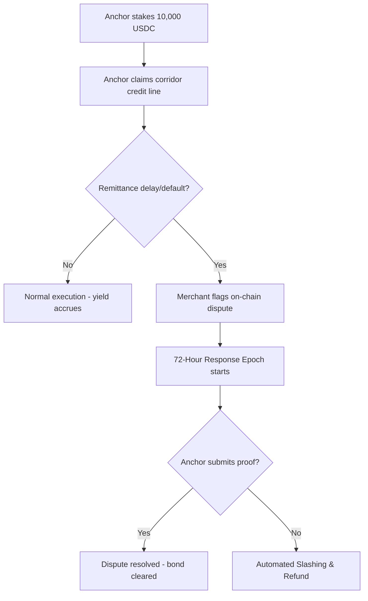

# Dispute & Claims Arbitrage

To maintain a completely decentralized, zero-trust corridor ecosystem, AnchorVault provides automated on-chain dispute claims mechanisms backed by staked anchor deposits. This guide outlines the programmatic lifecycle of disputes and slashing triggers.

---

## 1. On-Chain Disputes Lifecycle

---

## 2. Programmatic Security Sequence

To prevent escrow deadlock or manual third-party arbitration, all resolution pipelines execute deterministically via the `AnchorRegistry` contract:

### A. Gateway Reputation Lockup
Before an off-ramp anchor can claim an active cross-border remittance corridor, they must lock a minimum reputation bond of **10,000 USDC** inside the `AnchorRegistry` contract:

$$\text{Active reputation stakes} \ge \text{Minimum required threshold (10,000 USDC)}$$

### B. Merchant Challenge Initiation
In case of transaction default or cross-border settlement delay, the merchant initiates a dispute ticket on-chain, proving transaction failure by submitting the transaction hashes:

*   **Trigger Function:** `flag_dispute(merchant: Address, proof: BytesN<32>)`
*   **Action:** Instantly flags the target anchor's corridor and puts a temporary hold on further credit limits.

### C. Programmatic Slashing Arbitrage
When a dispute flag is opened, a **72-hour epoch window** starts:

1.  **Anchor Proof Submission:** The anchor must resolve the flag by presenting cryptographic signature receipts of physical cash delivery using `resolve_dispute(dispute_id: u64, receipt: BytesN<32>)`.
2.  **Slashed Payouts:** If the gateway fails to respond before the 72-hour epoch deadline, any merchant can trigger `liquidate_anchor(dispute_id: u64)`.
3.  **Outcome:** The registry instantly liquidates the anchor's locked bond, fully refunding the liquidity pool reserves and paying out the affected merchant directly.
